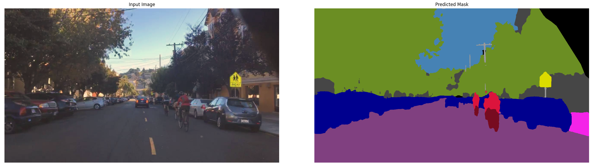
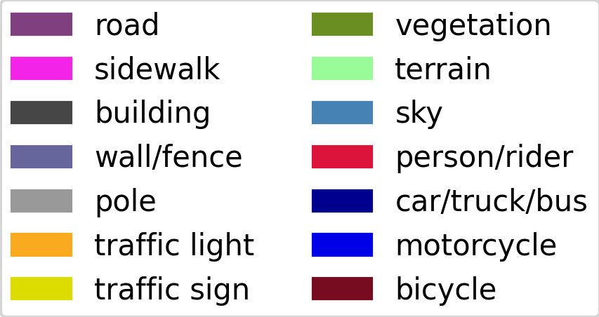

# U-Net Semantic Segmentation model



We trained a U-Net model on the semantic segmentation task via the [BDD100k](https://arxiv.org/abs/1805.04687) dataset. The dataset includes images from road scenes with 19 diverse classes and various locations, times and weathers. The current iteration achieved an accuracy $0.8797$ on the test set vs. a random guessing accuracy of $1/19 \approx 0.0526$.

## Usage Instructions
### Pre-requisites
1. Clone the repository:
   ```bash
   git clone https://github.com/Mairex1337/U-Net-SSeg.git
   ```
2. Create and activate a virtual environment:
   ```bash
   python3 -m venv venv
   source venv/bin/activate
   ```
3. Navigate to the project root:
   ```bash
   cd U-Net-SSeg
   ```
4. Install dependencies:
   ```bash
   pip install -r requirements.txt
   ```
5. Download the model checkpoint:
   ```bash
   python -m scripts.download_checkpoint
   ```

### Expected Input Format

As per the assignment instructions, the API expects a `.json` file containing base64-encoded image data:

```json
{
  "image_names": ["name.jpg", ...],
  "images": ["/9j/4AAQSkZJRgABAQAAAQABAAD/...", ...]
}
```

- You can use the provided `api_images.json`, or convert your own images with:

  ```bash
  python -m scripts.img_json \
    --path-to-images /path/to/image_folder \
    --output-path /path/to/save/json \
    --file-name optional_filename.json
  ```

### Running the API

Launch the API server:
   ```bash
   python -m api.main
   ```
Request via curl:
   ```bash
      curl -X POST \
      http://127.0.0.1:8000/predict/ \
      -H "accept: application/json" \
      -H "Content-Type: multipart/form-data" \
      -F "file=@api_images.json;type=application/json"
   ```
Change `api_images.json` as needed to the file you want the model to do inference on.

Request via GUI:
- Open the `/docs` page in your browser (URL printed in terminal).
- Go to the `/predict/` endpoint and click **"Try it out"**.
- Upload `api_images.json` or your own converted file.
- Click **"Execute"** to run inference.
- Download the `output.json` file from the response.


### Converting the Output JSON Back to Images

To view the predictions, convert the `output.json` back to images using:

```bash
python -m scripts.json_img \
  --path-to-json /path/to/output.json \
  --output-path /path/to/save/images
```

### Class Mapping

Colormap class mappings:


The class indices in the prediction masks correspond to:

```yaml
0: road
1: sidewalk
2: building
3: wall
4: fence
5: pole
6: traffic light
7: traffic sign
8: vegetation
9: terrain
10: sky
11: person
12: rider
13: car
14: truck
15: bus
16: train
17: motorcycle
18: bicycle
```