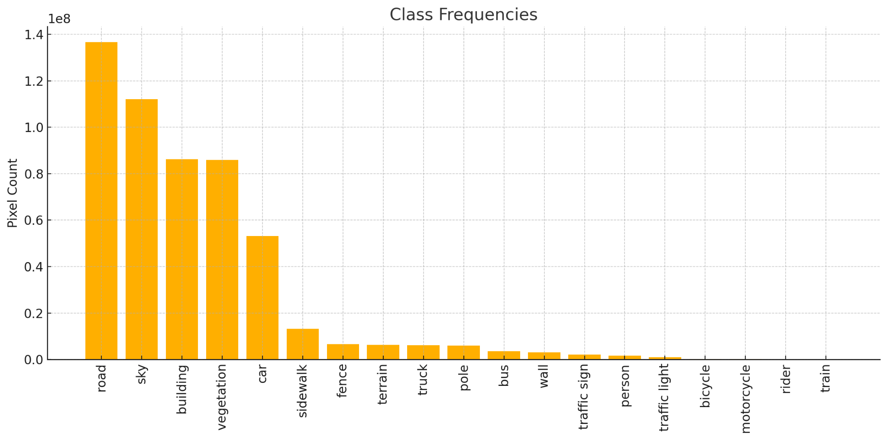

# 🚗 U-Net Semantic Segmentation Model


We trained a U-Net model for semantic segmentation using the [BDD100k](https://arxiv.org/abs/1805.04687) dataset. This dataset contains images from road scenes with **19 semantic classes**, captured under diverse conditions (e.g., weather, time, location).

Due to labelling inconsistencies and extreme class imbalance we combined and excluded classes such that we ended up using 14. We merged `car + truck + bus`, `wall + fence`, and `person + rider`. We removed the `train` class due to being extremely rare and being commonly mislabeled.




### 📊 Evaluation Metrics by Loss Function

As class imbalance is the key challenge for the semantic segmentation task, we decided to compare 4 different losses that are commonly used for such tasks in the literature.

| Loss Function | Pixel Accuracy | Mean Accuracy | Mean IoU | Mean Dice (F1) |
|---------------|----------------|----------------|----------|----------------|
| Weighted CEL  | 0.8926         | 0.6653         | 0.5270   | 0.6554         |
|OHEM CEL       | 0.8965         | 0.5833         | 0.5046   | 0.6216         |
|Dice loss      | 0.8915         | 0.6286         | 0.5435   | 0.6744         |
|Dice loss + CEL | 0.9041        | 0.6353         | 0.5575   | 0.6856         |

---

## 🛠️ Usage Instructions

### ✅ Pre-requisites

1. **Clone the Repository**

   ```bash
   git clone --depth 1 --branch main https://github.com/Mairex1337/U-Net-SSeg.git
   ```

2. **Create and Activate Virtual Environment**

   ```bash
   python3 -m venv venv
   source venv/bin/activate
   ```

3. **Navigate to Project Root**

   ```bash
   cd U-Net-SSeg
   ```

4. **Install Dependencies**

   ```bash
   pip install -r requirements.txt
   ```

5. **Download the Model Checkpoint**

   ```bash
   python3 -m scripts.download_checkpoint
   ```

6. **Memory Requirements**:

    You will need __at least__ 8gb of RAM to run the API or train a model from scratch.
    > If you still run in to `out of memory` errors, you can modify the image resizing configuration in `cfg.yaml` to the following:

    ```yaml
    transforms:
      resize:
      - 368
      - 640
    ```

---

## 🚀 API – Local Usage Guide

This section explains how to run and test the API locally.

> 🔧 Replace everything inside `<...>` with the appropriate file path or filename on your system.

---

### 🚀 Launch FastAPI

Start the FastAPI backend:

```bash
python3 -m api.main
```

Once running, explore and test all endpoints interactively via:

🌐 **Swagger UI**: [http://localhost:8000/docs](http://localhost:8000/docs)

Alternatively, you can use the provided `curl` commands below.

---

### Available API Endpoints

#### 1. `/predict/returns-json/` — **Base64 Image Prediction (JSON)**

Runs segmentation on one or more **base64-encoded images**.

##### 📤 Request Format

```json
{
  "image_names": ["image1.jpg", "image2.jpg"],
  "images": ["<base64-encoded-image1>", "<base64-encoded-image2>"]
}
```

##### 📥 Response

* Returns JSON with predicted masks (base64-encoded).
* Additionally writes an `output.json` file to the project root (which can be converted to `.png` masks).

##### Example cURL Command

```bash
curl -X POST http://127.0.0.1:8000/predict/returns-json/ \
  -H "accept: application/json" \
  -H "Content-Type: application/json" \
  -d @api_images.json \
  --output result.json
```

##### 🔄 Convert Images to Input JSON

If you want to convert your own images to the required input format:

```bash
python3 -m scripts.img_json \
  --path-to-images </path/to/images> \
  --output-path </path/to/save/json> \
  --file-name <output.json>
```
To use in the curl command, replace the `api_images.json` with your converted file.

##### 🔄 Convert Output JSON to Images

Visualize predictions with:

```bash
python3 -m scripts.json_img \
  --path-to-json </path/to/output.json> \
  --output-path </path/to/save/images>
```

---

#### 2. `/predict-image/returns-zip/` — **Image Upload Prediction**

Runs segmentation on `.jpg`, `.png`, or a `.zip` archive of image files.

##### 📤 Request Format

* Single image (`.jpg`, `.png`)
* or `.zip` archive of multiple images

##### 📥 Response

* A `.zip` file containing:

  * Original image(s)
  * Predicted mask(s)
  * Colorized prediction(s)

##### Example cURL Command

```bash
curl -X POST http://127.0.0.1:8000/predict-image/returns-zip/ \
  -H "accept: application/zip" \
  -F "files=@<image/or/zip/path/here>" \
  --output <result.zip>
```

---

#### 3. `/predict-video/returns-zip/` — **Video Upload Prediction**

Runs segmentation on a video file.

##### 📤 Request Format

* A `.mp4`, `.avi`, or `.mov` video

##### 📥 Response

A `.zip` archive containing:

* Extracted video frames
* Predicted mask frames
* Colorized mask frames
* Original video
* Predicted (masked) video

##### Example cURL Command

```bash
curl -X POST http://127.0.0.1:8000/predict-video/returns-zip/ \
  -H "accept: application/zip" \
  -F "file=@<video/path/here>" \
  --output <result.zip>
```

---

## 📺 Running the Streamlit Frontend

### 1. ✅ Start the FastAPI Backend First

The Streamlit app communicates with the API, so make sure the FastAPI server is running.

---

### 2. 🚀 Launch Streamlit

Start the frontend with:

```bash
streamlit run streamlit/app.py
```

Then open your browser and go to:

🌐 [http://localhost:8501](http://localhost:8501)

Check the **Instructions** page within the app for more usage details.

---


## 🐳 Run the API and Streamlit App with Docker

### 📥 Install Docker

👉 [https://docs.docker.com/desktop](https://docs.docker.com/desktop)


### 🧠 Memory Requirement

To run the application smoothly, ensure that your system meets the following memory requirements:

* Allocate at least **7–8 GB RAM** to Docker:
  **Docker Desktop → Settings → Resources → Memory**

---

### ▶️ Start Both Apps

```bash
docker-compose up -d
```

### 🌍 Access the Apps

* **Streamlit frontend**: [http://127.0.0.1:8501](http://127.0.0.1:8501)
* **FastAPI docs**: [http://127.0.0.1:8000/docs](http://127.0.0.1:8000/docs)

### 🛑 Stop the Services

```bash
docker-compose down
```


---

## 🏁 Training a Fresh Model from Scratch

To train the a model from scratch on your own BDD100k dataset:

### 1. Get the Dataset

```bash
python3 -m scripts.download_dataset
```

### 2. Adjust hyperparameters (optional)

In the `cfg.yaml` file, you can adjust e.g. `LR`, `Batch size`, `Epochs`, etc. under `hyperparameters/<model_name>`.

### 3. Train the model

```bash
python3 -m scripts.train.py --model <model_name>
```
Insert 'unet' or 'baseline' for 'model_name'.

__NOTE__:
- Training will require at least 8GB of RAM.
- Make sure the `venv` with dependencies is activated.
- Training even one epoch of the U-Net model without an NVIDIA GPU is likely computationally unfeasible.

### 4. Viewing results

All checkpoints and logs will be stored in the _run directory_ which can be found here: `outputs/<model_name>/<run_id>`

### 5. Evaluate the trained model

If you would like to evaluate the trained model, you can do so via the appropriate `run_id` and the `model_name`:

```bash
python3 -m scripts.eval --model <model_name> --run-id <run_id>
```

Evaluation will automatically use the _best_ checkpoint.
After evaluation, you will find metric results as well as predictions from the model in the _run directory_.

---

## 🗺️ Class Mapping & Legend


```yaml
  0: road
  1: sidewalk
  2: building
  3: wall/fence
  4: pole
  5: traffic light
  6: traffic sign
  7: vegetation
  8: terrain
  9: sky
  10: person/rider
  11: car/truck/bus
  12: motorcycle
  13: bicycle
```

---
